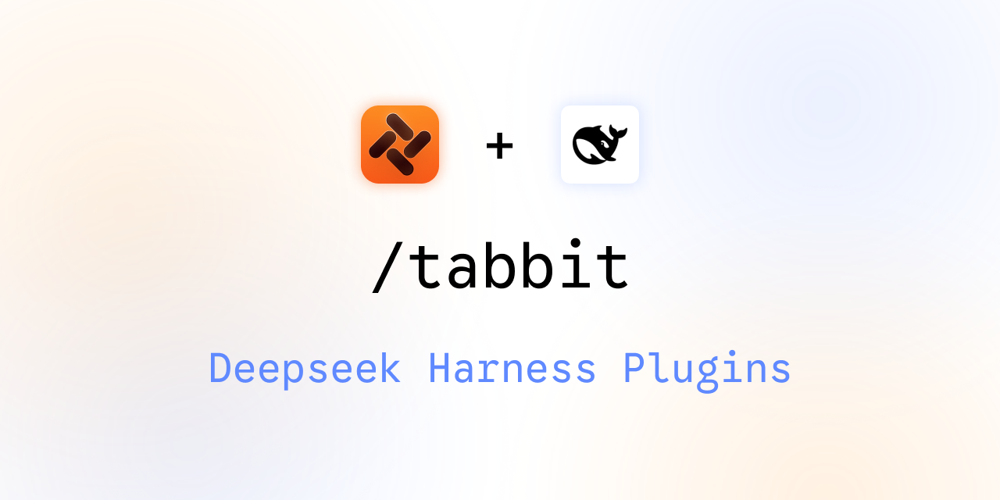

# dsh-tabbit — Tabbit's Official DeepSeek Harness Plugin

**English** | [简体中文](README.md) | [Changelog](CHANGELOG.md)



A DeepSeek Harness (dsh) plugin bundle for Tabbit Browser. Through this
plugin, dsh calls on Tabbit to complete agent tasks: real pages, real login
state, real interactions, driven through a native code-first tool (not shell
round-trips). Use it for web automation, information extraction, QA, and
benchmarks.

## What you get

| Component | Description |
|---|---|
| `tabbit_browser` | Read and operate web pages using Tabbit's real, built-in CLI mode. |
| Browser-backed `web_fetch` | Re-points dsh's `web_fetch` to Tabbit itself (dsh's built-in direct fetcher has no JS rendering, no login state, and bypasses the system proxy — under a fake-IP proxy setup it refuses every domain). |
| "Web tabs" `@` mention | Type `@` in the dsh Web UI input box to list pages open in this session's browser tasks **and every tab in the user's browser** — pick one to add as context. |
| Dedicated "page access" permission | Full permission controls. Because dsh shares the user's cookies when it reaches Tabbit pages, it confirms `pageAccess` (asked once per session by default) and `intranetFetch` (per-request approval when `web_fetch` targets an intranet address). |
| `tabbit_browser_install` tool | Environment preflight: detects an installed stable Tabbit build and verifies the launcher and Runtime Service; downloads Tabbit as a dsh background job when it's missing or outdated. |
| `tabbit_plugin_update` tool | Plugin update check: asks npm for the latest release at most once a day, and silently installs a suitable version in the background. |
| `/tabbit-info` command | Type `/tabbit-info` in the dsh input box for diagnostics: launcher, instance list (with product names), effective instance and its source, permission settings, task occupancy. |
| `tabbit` skill | Teaches the model best practices for using Tabbit. Defaults to Tabbit's own official skill at `~/.agents/skills/tabbit/` (it evolves with the browser runtime); this plugin bundles a fallback copy. |

## Installation

### Prerequisites

- A stable Tabbit Browser build ([international edition](https://www.tabbit.ai) or [China edition](https://www.tabbit.com/), `1.9.0` or newer) that has been launched at least once (this registers the CLI launcher on first launch).
- Node.js `>=22.19` and dsh `>=0.1.1-rc.2` (install dsh with `npm install -g @deepseek-ai/dsh`). On hosts below `0.1.2-alpha.1`, the built-in `web_fetch` tool is unavailable in Web app sessions (`tabbit_browser` is unaffected).

### Install dsh-tabbit

```bash
dsh plugin --profile web add dsh-tabbit                 # primary npm route
```

### Other install methods

```bash
dsh plugin --profile web add github:Tabbit-Browser/dsh-tabbit # fallback when npm is unreachable
dsh plugin --profile web add link:/path/to/dsh-tabbit   # local development
```

> This package supersedes the earlier `tabbit-browser` skill-only plugin, and
> continues on from the 0.2.x line published on npm — 0.2.x users get an
> upgrade notice from the daily update check, and simply re-running the
> install command upgrades in place.

## Community & Support

Scan the QR code below to join the **dsh-tabbit Developer Group** to share feedback, ask questions, and discuss new features:


## Settings

### Basic configuration

dsh Settings → `tabbit`, or `$DSH_HOME/settings.yaml`

```yaml
tabbit:
  instance: ""            # explicit 16-hex instance id (/tabbit-info lists them); usually leave empty
  launcherPath: ""        # override; default discovers tabbit-cli, falls back to tabbit-playwright; %LOCALAPPDATA%\Tabbit\LocalAgent\bin\tabbit-cli.exe on Windows
  pageAccess: ask         # ask (once per session) | always | never
  intranetFetch: ask      # web_fetch to intranet/loopback targets: ask (once per session+origin) | always | never
```

### Instance resolution priority

Priority order when this machine has more than one Tabbit build installed:

1. an explicit `tabbit.instance` setting;
2. **the Tabbit instance currently viewing dsh-web** (auto-detected: the
   client plugin pings `/tabbit/instance-hint` on page load, and the server
   traces the loopback socket's peer process up its parent chain to match the
   instance registry's `browserPid`; macOS only — naturally misses when a
   non-Tabbit browser has the page open) — "execute in whichever Tabbit
   you're viewing dsh in";
3. an inherited `TABBIT_PLAYWRIGHT_INSTANCE` environment variable (the
   authoritative channel in the embedded form: Tabbit injects its own
   instance id when it launches its bundled dsh);
4. automatic registry selection (the single online instance; an ambiguity
   error listing the candidates otherwise — on Windows, when the registry
   isn't readable, the native CLI picks for itself).

Check the currently effective source anytime with `/tabbit-info`
(`execution instance: ... (via ...)`).

**Full access note**: dsh's `danger-full-access` permission preset writes the
session's approval policy as `never` (dsh's definition: auto-deny every ask).
This plugin's permission gate detects that override and **auto-allows**
instead of issuing an ask that's guaranteed to be denied — full access means
full access (bash is already unrestricted in that mode, so gating only the
browser tool has no defensive value). Exception: a deployment-level default
of `never` (not a session override) isn't visible to the public API and still
gets denied — that combination gets a denial message pointing at the
`tabbit.pageAccess: always` escape hatch.

## Permissions & Security

- Because the agent shares the user's real login state, `pageAccess` is a
  dedicated permission independent of filesystem/sandbox permissions, and
  asks for user confirmation by default.
- Authorization is remembered: once a tool call succeeds, this session won't
  ask again; failures aren't recorded (a retry after failure asks again).

## Development

Developing and testing this project depends on a local
[deepseek-harness](https://github.com/deepseek-ai/deepseek-harness) checkout.
The `@deepseek-ai/*` packages published on npm generally lag too far behind
to install directly as dependencies, so you need to build a harness checkout
locally first, then point the repo's `.dsh-harness` symlink at it with the
script below (that path is already ignored in `.gitignore`). That's the only
place you configure it — neither `tsconfig.json` nor `package.json` needs
any changes.

Get and build deepseek-harness (skip if you already have one):
```bash
git clone https://github.com/deepseek-ai/deepseek-harness && cd deepseek-harness && pnpm install && pnpm build && cd ..
```

Point this repo at it — replace `/path/to/deepseek-harness` with your actual checkout path:
```bash
npm run link-harness -- /path/to/deepseek-harness   # or set DSH_HARNESS_PATH
```

Install and build:
```bash
pnpm install && pnpm build   # tsc → lib/
npm test                     # build + node --test tests/
```

## Known limitations / Roadmap

- Mentioning bookmarks/favorites isn't supported yet.
- Screenshots entering context require a model route that accepts image input.
- Windows regression testing is limited.
